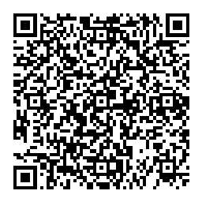

# Описание и инструкция
Это веб-приложение и сопутствующий бэкенд используется для быстрой регистрации участников массовых спортивных мероприятий с помощью QR- и штрих-кодов и сканера в мобильном телефоне. Для сканирования требуется специальная программа для Android: [BarcodeBee](../BarcodeBee-debug-0.33.apk)

## Применение
На любительских спортивных мероприятиях заметное время тратится на регистрацию участников перед стартом и на контрольных пунктах. Старый способ в среде [рандоннёров](https://ru.wikipedia.org/wiki/Рандоннёр) - записи ручкой в _бреветной карточке_ и в бумажном протоколе. Если выдать участникам идентификаторы заранее, а на контрольных пунктах использовать мобильный телефон с камерой, можно избежать ненужных задержек.

## Хостинг
Веб-приложение доступно по адресу https://baltic-star-cloud.web.app на платформе Google Firebase. Для авторизации (входа) нужно указать свой аккаунт Google. _(Другие способы рассматриваются.)_

## Идентификация
В приложении используются понятия _[бревет](https://ru.wikipedia.org/wiki/Рандоннёр), контрольный пункт и участник_. Каждый из них идентифицируется кодом - уникальным сочетанием букв и цифр, сгенерированным платформой. При желании можно заменить код на легко запоминающийся, но вручную и с осторожностью - дубликаты не допустимы.

### Контрольный пункт
Сопровождается одномерным штрихкодом (из чёрных и белых полосок) или двумерным QR-кодом. В формате QR доступна сопутствующая информация из описания [vCard](https://ru.wikipedia.org/wiki/VCard). Например,

    BEGIN:VCARD
    VERSION:4.0
    URL:https://baltic-star-cloud.web.app/brevet/jurvMkU0gmw1Ak29fwVj/checkpoint/nPgAHOJkBEe1XdlPrkkR
    X-TYPE:checkpoint
    FN:Старт
    UID:nPgAHOJkBEe1XdlPrkkR
    NOTE:9f919fd4fa1f4a2988e85792ab5459d5917bc2a807bd05722f2bcc90279003d4
    END:VCARD

В поле **NOTE** указана цифровая подпись идентификатора, с помощью которой сервер проверяет достоверность входящих сообщений. Подпись и содержащее его QR-изображение доступно только администраторам. Остальные видят только штрихкод.

### Участник
QR-код с подписью доступен только владельцу аккаунта и администраторам. . Остальные видят только штрихкод.

    BEGIN:VCARD
    VERSION:4.0
    URL:https://baltic-star-cloud.web.app/rider/JcXMTycJAHXRaafqWQgW
    FN:Иван Петров
    TEL;PREF:+79211234567
    N:Петров;Иван
    X-TYPE:rider
    UID:JcXMTycJAHXRaafqWQgW
    NOTE:aefde262df9dbd840838d82eed390a5ca6e5e7d9b3749f723a40fa65aa902f6a
    END:VCARD

Можно сократить количество полей, чтобы уменьшить размер изображения и улучшить читаемость, но тогда его нельзя будет импортировать в контакты.

    BEGIN:VCARD
    VERSION:4.0
    FN:Иван Петров
    X-TYPE:rider
    UID:JcXMTycJAHXRaafqWQgW
    NOTE:aefde262df9dbd840838d82eed390a5ca6e5e7d9b3749f723a40fa65aa902f6a
    END:VCARD

Читайте далее [сценарии использования](usage.md).
