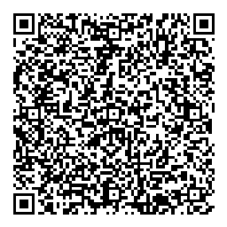
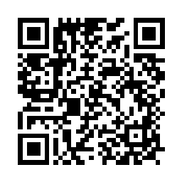
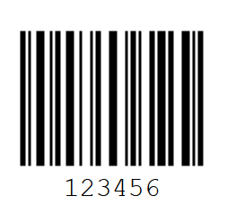

# Описание и инструкция
Это веб-приложение и сопутствующий бэкенд используется для быстрой регистрации участников массовых спортивных мероприятий с помощью QR- и штрих-кодов и сканера в мобильном телефоне.

## Применение
На любительских спортивных мероприятиях заметное время тратится на регистрацию участников перед стартом и на контрольных пунктах. Старый способ в среде [рандоннёров](https://ru.wikipedia.org/wiki/Рандоннёр) - записи ручкой в _бреветной карточке_ и в бумажном протоколе. Если выдать участникам идентификаторы заранее, а на контрольных пунктах использовать мобильный телефон с камерой, можно избежать ненужных задержек.

## Хостинг
Веб-приложение доступно по адресу https://brevet.online на платформе Google Firebase. Для авторизации (входа) нужно указать свой аккаунт Google. _(Другие способы рассматриваются.)_

## Идентификация
В приложении используются понятия _[бревет](https://ru.wikipedia.org/wiki/Рандоннёр), контрольный пункт и участник_. Каждый из них идентифицируется кодом - уникальным сочетанием букв и цифр, сгенерированным платформой. При желании можно заменить код на легко запоминающийся, но вручную и с осторожностью - дубликаты не допустимы.

### Контрольный пункт
Сопровождается одномерным штрихкодом (из чёрных и белых полосок) или двумерным QR-кодом. В формате QR передаётся ссылка URL на страницу контрольного пункта либо участника.

    https://brevet.online/c/108oFCZ0AqFFP1gjI733

QR-изображение доступно только авторизованным пользователям. Остальные видят только штрихкод.

### Участник
QR-код доступен только владельцу аккаунта и администраторам. Остальные видят только штрихкод.

    https://brevet.online/rider/aIltuBEDm2gqoBAXZVzal1MfOhB3

Читайте далее [сценарии использования](usage.md).
