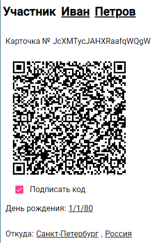

# Сценарии работы
Перед стартом бревета следует завести его описание, контрольные пункты и участников. Эти операции доступны только администраторам (используйте кнопку **Войти**).

## Бревет
Создайте новое мероприятие на главной странице кнопкой **Добавить**. Заполните название, километраж и дату старта.

К бревету можно добавить несколько контрольных пунктов, включая старт и финиш.

## Контрольный пункт
Заполните название контрольного пункта и дистанцию от старта: список пунктов будет отсортирован по ней.

## Участник
На главной странице пройдите в раздел [Список участников](https://baltic-star-cloud.web.app/riders) и заведите себе карточку. Добавление  новых карточек администратором пока не работает, но можно редактировать чужие.

# Первый (основной) сценарий
Участники распечатывают свои карточки дома или получают на старте и возят с собой. Волонтёр на каждом КП сканирует QR-код этого КП и встречает приезжающих, сканируя их карточки при въезде и выезде (можно много раз: считается только первый и последний). 

Отметки появляются в таблице на странице КП и в сводной таблице бревета.

+ Таблица отметок КП1

  
+ Сводная таблица отметок бревета

  

Волонтёры могут работать одновременно вдвоём-втроём на одном КП, тогда следует отсканировать одинаковый QR-код. Или переезжать с одного КП на другой, тогда нужно отсканировать новый код на следующем КП. Список отметок в программе автоматически заменяется и обновляется.

+ Таблица отметок КП1 в мобильном телефоне

  

### Проверка
В программе BarcodeBee (Штрихо-пчёлка) выберите меню Очистить и отсканируйте QR-код КП Старт. Название появится в заголовке. Отсканируйте несколько раз QR-код или штрихкод тестовой или своей карточки. Дождитесь результата ОК в таблице, также появится имя участника. Затем переходите к следующему КП. [Ссылка на страницу тестового бревета.](https://baltic-star-cloud.web.app/brevet/jurvMkU0gmw1Ak29fwVj)

+ [Старт](https://baltic-star-cloud.web.app/brevet/jurvMkU0gmw1Ak29fwVj/checkpoint/nPgAHOJkBEe1XdlPrkkR)

  
+ [КП1: Первый](https://baltic-star-cloud.web.app/brevet/jurvMkU0gmw1Ak29fwVj/checkpoint/J2g86qs2ShEZQavN93Wd)

  
+ [КП2: Второй](https://baltic-star-cloud.web.app/brevet/jurvMkU0gmw1Ak29fwVj/checkpoint/GaP8rmoV4xREawdzZTVe)

  
+ [Финиш](https://baltic-star-cloud.web.app/brevet/jurvMkU0gmw1Ak29fwVj/checkpoint/7cd1fLA72KJpqHGt5OPh)

  

Тестовая карточка Ивана Петрова

В этом сценарии достаточно простого штрихкода участника, но и его QR-карта сработает.

# Второй (самостоятельный) сценарий
При отсутствии волонтёров можно использовать обратный, самостоятельный вариант, полагаясь на честность участников. Штрихкоды контрольных пунктов нужно распечатать дома или заранее разместить на маршруте. QR-коды КП с подписью раздавать нельзя из соображений конфиденциальности. Напротив, для авторизации участника нужно использовать именно его QR-код. В мобильном телефоне будут появляться только персональные отметки участника.

+ Таблица отметок участника в мобильном телефоне

  

### Проверка
В программе BarcodeBee (Штрихо-пчёлка) выберите меню Очистить и отсканируйте QR-код тестовой или своей карточки участника. Название появится в заголовке. Отсканируйте несколько раз каждый штрихкод КП. Дождитесь результата ОК в таблице, также появится название КП. Затем переходите к следующему КП. [Ссылка на страницу тестового бревета.](https://baltic-star-cloud.web.app/brevet/jurvMkU0gmw1Ak29fwVj)

Тестовая карточка Ивана Петрова

+ [Старт](https://baltic-star-cloud.web.app/brevet/jurvMkU0gmw1Ak29fwVj/checkpoint/nPgAHOJkBEe1XdlPrkkR)

  
+ [КП1: Первый](https://baltic-star-cloud.web.app/brevet/jurvMkU0gmw1Ak29fwVj/checkpoint/J2g86qs2ShEZQavN93Wd)

  
+ [КП2: Второй](https://baltic-star-cloud.web.app/brevet/jurvMkU0gmw1Ak29fwVj/checkpoint/GaP8rmoV4xREawdzZTVe)

  
+ [Финиш](https://baltic-star-cloud.web.app/brevet/jurvMkU0gmw1Ak29fwVj/checkpoint/7cd1fLA72KJpqHGt5OPh)

  
